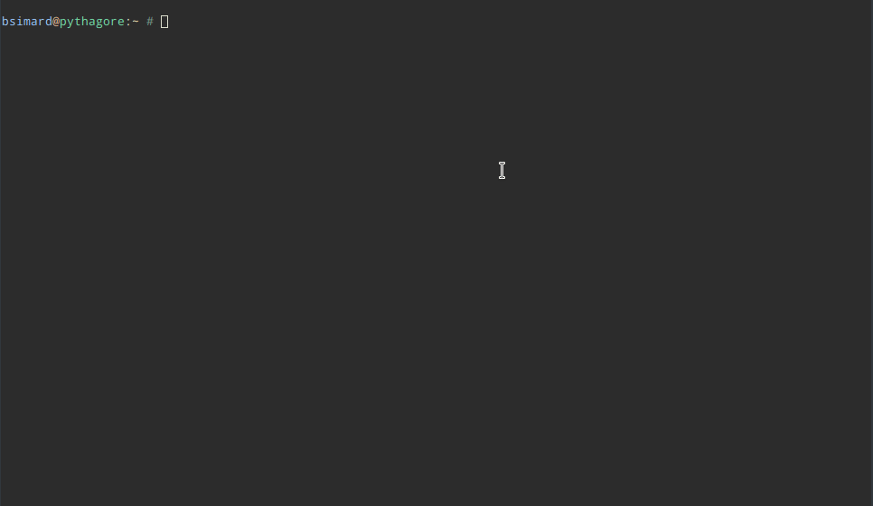

= Neo4j Supervisor

This is a pure bash script that use the cypher-shell of Neo4j to help you to monitor a data loading process.
It produces a visulation directly in the bash, like a top.

== Usage

Usage: `neo4j-supervisor -l /opt/neo4j -c bolt://localhost -u neo4j -p l3tm31n`

Where

* **l:** path location of neo4j (or use the env $NEO4J_HOME)
* **c:** bolt connection url (or use the env $NEO4J_CONNECTION | default: `bolt://localhost:7687` )
* **u:** neo4j user (or use the env $NEO4J_USER | default: `neo4j`)
* **p:** neo4j password (or use the env $NEO4J_PASSWORD)

You can define the parameters directly in the command, or by using some environment variables.
If a parameter is missing, you will be prompt for it.

== How to red the chart

===  Colors

* red color is for deletion
* green color is for creation

=== Symbols

* **@:** 1000 items
* **#:** 100 items
* **=:** 10 items
* **-:** 1 item

So `@@@#====--` means **3142**

